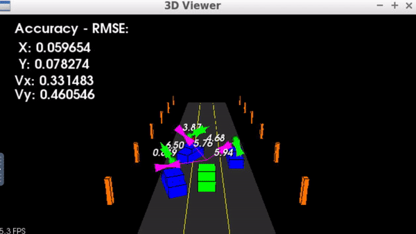
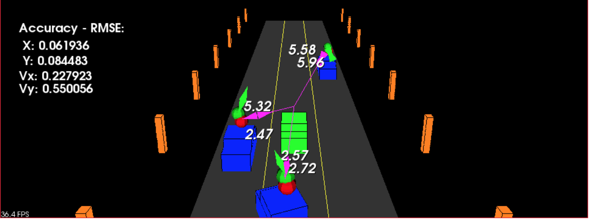

# Unscented Kalman Filter
## Project background
In order to estimate the state of a moving object, the Kalman filter algorithm from statistical control theory was introduced and designed around 1960 for aerospace guidance applications. However, Kalman filter is based on linear quadratic estimation which lacks of relevant non-linearity in real-world problems. In order to adopt non-linearity with Lidar and Radar sensor measurements in the context of current self-driving car, Extend Kalman Filter [EKF](https://github.com/tooth2/Extended-Kalman-Filter) adapted multivariate Taylor-series expansions to linearize non-linearity and has become a standard technique used to the field of nonlinear estimation esp. navigation/guidance applications. However, if the initial estimate of the state is wrong, or if the process is modeled incorrectly, the filter may quickly diverge. Unscented Kalman Filter, on the other hand, does not need to linearize non-linear functions by using a deterministic sampling approach, instead, ukf takes representative points from a Gaussian distribution. These sample points completely capture the true mean and covariance and when propagated through the true nonlinear system, captures the posterior mean and covariance accurately to the 3rd order (Taylor series expansion) for any nonlinearity. In this project Unscented Kalman Filter is implemented to estimate the state of multiple cars on a highway using lidar and radar measurements.

## Code Structure
* `ukf.cpp`and  `ukf.h` : Unscented Kalman Filter implementation
* `measurement_package.h` : Struct sesnsor type (Lidar(Laser) vs Radar) and Eigen vectors for raw measurements
* `tools.h`, and  `tools.h`: sense where a car is located using Lidar / Radar measurement using pre-generated lidar marker by lidarSense function, show UKF results (predicted future path) , and calculates RMSE.
* `main.cpp`: Create simple 3d highway enviroment using PCL for exploring self-driving car Lidar/Radar sensors
* `highway.h`: Handle logic for creating traffic on highway and animating 30 frame per second.
* render/ `render.h`,  `render.cpp`,  `box.h`: Functions and structs used to render the enviroment - cars and the highway
* sensors/ `lidar.h`: car's position, groundSlope, minDistance, maxDistance, resultion

---
## Result
### Accuracy
To measure how well the ukf filter performs, RMSE(root mean squared error) is used by comparing the UKF filter results(estimation list) with the provided ground truth. To compute RMSE , the estimation vector size should equal ground truth vector size or the estimation vector size should not be zero. RMSE is computed staring from the residual(the error difference between estimates and ground truth value). By multiplying residuals coefficient-wisely and accumulated squared residuals and then calculate its mean and gets the square root of this value.
> RMSE of [px, py, vx, vy]  <= [0.30, 0.16, 0.95, 0.70] after running for longer than 20 seconds on the highway.


[output_video](ukf.mp4)

|Criteria|Sensor_Fusion(both Lidar and Radar)| Lidar only mode| Radar only mode|
|:--|:--:|:--:|:--:|
|Position(px,py) RMSE | Less than Thresholds | Less than Thresholds | Over the Threshdolds |
|Velocity(vx,vy) RMSE | Less than Thresholds | Over than Thresholds | Over the Threshdolds |
|Both| best performace| px,py meets the spec but slightly over vx and vy | all four px, py, vx, vy is way over the thresholds|

This shows RADAR measurements are tend to be more more noisy than the LIDAR measurements. Thus using both sensor fusion can reduce the noise/errors from sensors.

## Implementation Approach


The main program can be built and ran by doing the following from the project top directory.
`main.cpp` is using `highway.h` to create a straight 3 lane highway environment with 3 traffic cars and the main ego car at the center.
The viewer scene is centered around the ego car and the coordinate system is relative to the ego car as well. The ego car is green while the
other traffic cars are blue. Each of the three vehicles should be tracked with estimated position and estimated velocity value and direction. The traffic cars will be accelerating and altering their steering to change lanes. Each of the traffic car's has it's own UKF object generated for it, and will update each indidual one during every time step. The red spheres above cars represent the (x,y) lidar detection and the purple lines show the radar measurements with the velocity magnitude along the detected angle. The Z axis is not taken into account for tracking, only tracking along the X/Y axis needs to be considered.

#### Velocity Model(CTRV)
For vehicle modeling, constant turn rate and velocity magnitude model (CTRV) ,  which assumes constant velocity and turning rate, is applied rather than assuming constant velocity only. For the CTRV model, two parameters define the process noise:
1. `stad_a_`: representing longitudinal acceleration noise in m/s^2
2. `std_yawdd_`: representing yaw acceleration noise  in rad/s^2 (angular acceleration)

#### Radar coordinate conversion
For radar measurements, radar will be represented in polar co-ordinates thus the equations that map from cartesian to polar coordinates to convert the  values of radar to X,Y are implemented.
```c++
// coordinate conversion
float px = ro * cos(phi);
float py = ro * sin(phi);
float vx = ro_dot * cos(phi);
float vy = ro_dot * sin(phi);
float v = sqrt(vx*vx + vy*vy);
```
#### Unscented Kalman Filter Algorithm Summary (in ukf.cpp/ukf.h)
This program defines the predict function, the update function for lidar, and the update function for radar.
1. **Initialization**
`ukf.h` defines the Unscented KalmanFilter class containing the object state vector(`VectorXd x_`) as well as state covariance matrix(`MatrixXd P_`).
`ukf.cpp` Initialize the position of the state vector based on the first measurements, state covariance matrix, process noise standard deviation longitudinal acceleration in m/s^2, process noise standard deviation yaw acceleration in rad/s^2, and Lidar/Radar measurement noise values.
Once the ukf gets initialized, the next iterations of the for loop will call the ProcessMeasurement() function to do the predict and update steps. Then the prediction and update steps repeat themselves in a loop.

2. **ProcessMeasurement** between lidar and radar
Although radar gives angular velocity data in the form of the range rate ρ˙, a radar measurement does not contain enough information to determine the state variable velocities vx and vy, so sets vx=0, vy=0 same as lidar, however, use the radar measurements rho(ρ) and phi(ϕ) to initialize the state variable locations px and py.
>Δt: the time elapsed between the current and previous measurements
* For Lidar, initialized the object state vector x using reading first element's position (x,y): [x, y, 0, 0] (px=x,py=y, vx=0, vy=0)
* For Radar, used rho(ρ) and phi(ϕ) information to initialize the state variable locations px and py: [rho * cos(phi), rho * sin(phi), 0,0]

3. First predicts then updates : predicts object position to the current timestep and then update the prediction using the new measurement.
**Prediction** UKF::Prediction(double delta_t)
Upon receiving a sensor measurement after a time period Δt, the UKF filter estimates the object's location where moving object is going to be after a time step Δt.
> angle normalization:When calculating the predicted state covariance matrix, the difference between the mean predicted state and a sigma point should be calculated. here ,the state contains an angle thus subtracting angles is a problem for Kalman filters, because the result might be 2π plus a small angle, instead of just a small angle. So that normalization is added to calculate the difference between angles.
**Update** UKF::UpdateLidar
Updating the object's position (the state vector, x_,  covariance, P_) based on sensor measurements(Lidar or Rasor)
- Calculate mean predicted measurement,  measurement covariance matrix S, cross correlation matrix and kalman gain K
- Update state mean and covariance matrix
> Avoid division by zero
Check to avoid "division by zero" --> handles error where both the x and y values might be zero or px*px + py*py might be close to zero

### tools.cpp
This program is responsible to
1. reads in data , parses data measurements
2. call a function to run the Unscented Kalman filter to show ukf tracking and predicted future path
3. call a function to calculate RMSE

> *INPUT*:
["sensor_measurement"] => the measurement values (either Lidar or Radar), timestamp and Groundtruth values, which represents the actual path the moving vehicle took,(yaw and yaw rate ground truth values are not used.)
Whereas Radar has three measurements (rho, phi, rhodot), Lidar has two measurements (x, y).

> *OUTPUT:RMSE*
The accuracy is being calculated by the RMSE, root mean squared error over each time step and for each car. The RMSE is looking at the error difference between the ground truth and estimated position and velocities. All the cars are considered in the RMSE value so if one car is particularly inaccurate it would affect the overall RMSE.
- estimation x, y position: [estimate_x, estimate_y]
- calculated RMSE: [rmse_x, rmse_y, rmse_vx, rmse_vy]

---
## Running Environment
### Requirements to run the project
1. gcc/g++ >= 5.4
2.  [PCL 1.2](https://github.com/PointCloudLibrary/pcl) The Point Cloud Library (PCL) is a standalone, large scale, open project for 2D/3D image and point cloud processing.

---
## Code Style
Followed [Google's C++ style guide](https://google.github.io/styleguide/cppguide.html).

---
## Addional Task: Generating Additional Data
for instance lidar markers could be the (x,y) center of bounding boxes by scanning the PCD environment and performing clustering
- [x]Extended Kalman Filter
- [x]Unscented Kalman Filter
- [ ]Lidar Obstacle Detection

